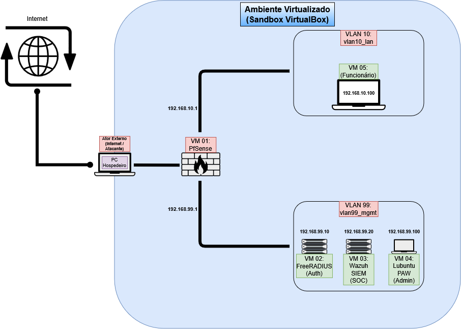
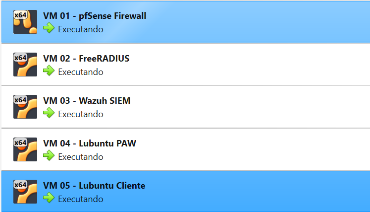
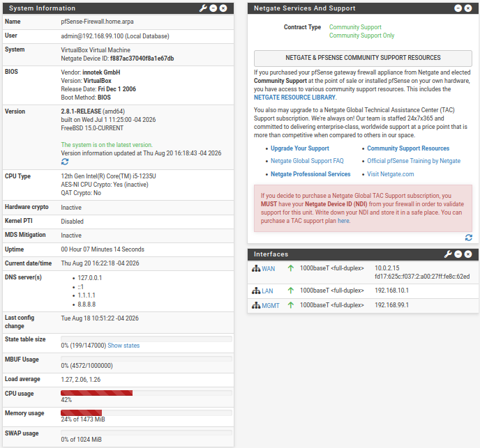
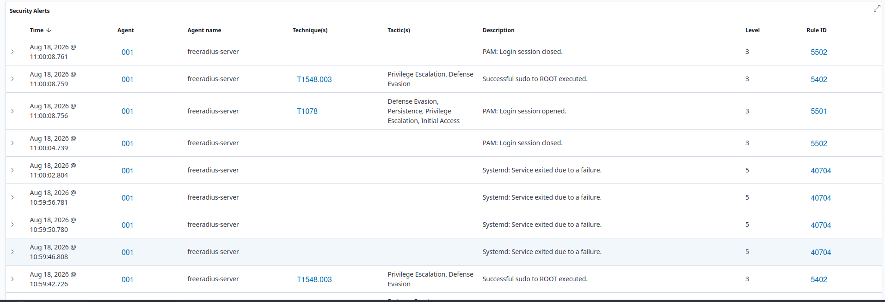

# 🛡️ Enterprise Security Sandbox: Segmentação por VLANs, Controle 802.1X & SIEM

Este projeto simula o funcionamento de uma infraestrutura de rede corporativa segura dentro de um ambiente de testes isolado (*sandbox*) no VirtualBox. Ele valida a implementação prática de segmentação de redes por VLANs, o gerenciamento de segurança por meio de uma estação de trabalho dedicada (PAW), o controle de acessos baseados em identidade (802.1X/RADIUS) e a centralização de logs para monitoramento em tempo real (SIEM Wazuh).

Toda a infraestrutura foi projetada para rodar de forma isolada, sem causar nenhum impacto ou alteração na rede física doméstica do operador.

---

## 🎯 1. O que é este projeto? (A Analogia do Condomínio)

Para tornar este laboratório compreensível para qualquer público, imagine que criamos um **Condomínio Fechado Virtual** dentro do computador, dividido em duas áreas lógicas isoladas:

*   **🏢 VLAN 10 (Rede LAN de Clientes):** O Bairro dos Usuários comuns. É onde o computador do funcionário trabalha. Ele recebe IP automático e precisa se autenticar para poder acessar a internet, mas é bloqueado de acessar a gerência.
*   **🔒 VLAN 99 (Rede MGMT - Gerenciamento):** O Bairro da Administração. Área de alta segurança onde ficam os servidores críticos (FreeRADIUS e Wazuh) e a máquina de gerência (PAW). É totalmente isolada dos usuários comuns da VLAN 10.
*   **👮 VM 01 (pfSense CE):** O Guarda da Guarita. Fica localizado exatamente na divisa entre as duas redes e controla toda a passagem de dados de um bairro para o outro e para a internet.

---

## 🗺️ 2. Arquitetura Lógica da Sandbox

O diagrama abaixo ilustra o fluxo de dados e o isolamento lógico das redes. O firewall pfSense atua como o único gateway conectando todos os segmentos:

### Matriz de Segmentação de Redes (VLANs no VirtualBox)

| Zona de Segurança / VLAN | Interface VirtualBox | Endereçamento IP | Utilidade Prática no Laboratório |
| :--- | :--- | :--- | :--- |
| **🌐 WAN (Internet)** | Placa 1: Modo NAT | DHCP (VirtualBox) | Provedor de internet estável e mascarado para atualização de pacotes. |
| **🔒 VLAN 99 (MGMT)** | Placa 2: `vlan99_mgmt` | `192.168.99.0/24` | **Área Restrita.** Contém os servidores críticos (FreeRADIUS e Wazuh) e a máquina de gerência (PAW). |
| **💼 VLAN 10 (LAN)** | Placa 3: `vlan10_lan` | `192.168.10.0/24` | **Área do Funcionário.** Onde o computador de testes (VM 05) se conecta e exige autenticação. |

---

## 💻 3. Especificação das Máquinas Virtuais (VMs)

Para garantir estabilidade em um computador hospedeiro com **16 GB de RAM**, os recursos foram otimizados de forma a consumir apenas **~8.5 GB** de memória RAM física do host:

*   **VM 01 - pfSense Firewall & Roteador** | 1 vCPU | 1.5 GB RAM | SO: FreeBSD
    *   *Função:* Monitorar e aplicar regras de firewall de entrada e saída, distribuir IPs na VLAN 10 (DHCP) e servir como servidor de tempo NTP local.
*   **VM 02 - FreeRADIUS Server** | 1 vCPU | 1.0 GB RAM | SO: Ubuntu Server LTS
    *   *Função:* Servidor de autenticação corporativo (802.1X). Contém as contas de rede autorizadas. Roda um **Wazuh Agent** ativo para coletar logs.
*   **VM 03 - Wazuh SIEM** | 2 vCPUs | 4.0 GB RAM | SO: Ubuntu Server LTS
    *   *Função:* Centralizador e correlacionador de eventos de segurança (SOC). Recebe syslogs do pfSense e logs dos agentes via criptografia.
*   **VM 04 - Lubuntu PAW (Estação de Trabalho do Administrador)** | 1 vCPU | 2.0 GB RAM | SO: Lubuntu Desktop
    *   *Função:* Máquina restrita utilizada exclusivamente pelo administrador (Felipe) para configurar o pfSense e o Wazuh. Fica isolada na VLAN 99. Roda um **Wazuh Agent** ativo.
*   **VM 05 - Lubuntu Cliente (João - O Funcionário)** | 1 vCPU | 1.0 GB RAM | SO: Lubuntu Desktop
    *   *Função:* Máquina de testes usada para simular o comportamento de um funcionário comum tentando navegar na internet. Fica na VLAN 10.

---

## 🛡️ 4. Defesa em Profundidade na Prática (Controle & Auditoria)

Este projeto implementa múltiplos controles de segurança alinhados às melhores práticas de defesa em profundidade:

1.  **Sincronização de Tempo Local (NTP):** O pfSense atua como o servidor NTP mestre da rede (`a.ntp.br`). As VMs 02 e 03 sincronizam a hora de forma automatizada pelo IP `192.168.99.1` (porta 123/UDP), garantindo que todos os logs tenham exatamente o mesmo segundo para análises forenses.
2.  **Gerenciamento Privilegiado (PAW/SAW):** O acesso administrativo do pfSense é trancado por regras de firewall. Apenas a máquina de gerência **PAW (IP 192.168.99.100)** consegue abrir a página web de configurações (`https://192.168.99.1`). Qualquer outra máquina (mesmo na mesma rede) é bloqueada.
3.  **Controle Baseado em Identidade (RADIUS):** O pfSense bloqueia toda a internet da VLAN 10 por meio de um **Captive Portal**. Quando o computador do João tenta navegar, ele é barrado e obrigado a digitar usuário e senha. O pfSense consulta o FreeRADIUS para validar e liberar a internet.
4.  **Auditoria Centralizada (SIEM):** O Wazuh recebe e analisa os syslogs do pfSense e os logs do FreeRADIUS em tempo real. Ele detecta de forma automática ações de privilégio administrativas (`sudo to ROOT`) e falhas ou sucessos de login no RADIUS, mapeando os comportamentos diretamente com o framework de ameaças **MITRE ATT&CK** (Técnicas `T1548.003` e `T1078`).

## 📸 5. Demonstração Prática (Provas de Trabalho)

Abaixo estão os registros visuais que comprovam a integridade e o funcionamento de toda a nossa infraestrutura de segurança:

### A. Orquestração do Laboratório (Hypervisor VirtualBox)
Esta imagem comprova a gerência de virtualização do laboratório, rodando simultaneamente 5 máquinas virtuais de forma estável e otimizada no notebook pessoal:

### B. Painel de Controle de Redes (pfSense Firewall)
Esta imagem mostra o painel do pfSense operacional na PAW, com as três interfaces (WAN, LAN e MGMT) perfeitamente sincronizadas por NTP local e com IPs ativos:

### C. Monitoramento de Logs no SOC (Wazuh SIEM)
Esta imagem da central do SOC (Wazuh) comprova a coleta e a indexação de mais de 190 eventos reais de segurança de rede, incluindo as auditorias do FreeRADIUS e as elevações de privilégio administrativo:

---

## ⏱️ Histórico de Revisões

| Versão | Data | Alteração Realizada | Autor |
| :--- | :--- | :--- | :--- |
| v1.0 | 03/08/2026 | Planejamento inicial da arquitetura simplificada (LAN/MGMT) e aprovação do escopo operacional. | Felipe O. Figueiredo |
| v1.1 | 13/08/2026 | Implantação concluída, correção do bug de estouro de disco, ativação do RADIUS e logs do SIEM validados. | Felipe O. Figueiredo |
